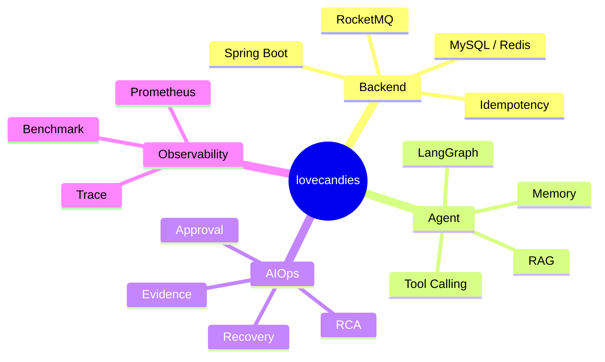

<h1 align="center">Hi, I'm lovecandies</h1>

  Java 后端开发 · Agent 工程实践 · AIOps / RAG / 异步系统

  
  
  

  

## Tech Stack

  
  
  
  
  
  
  
  
  
  
  
  

## Project Map

## GitHub Activity

  
  

  <picture>
    <source media="(prefers-color-scheme: dark)" srcset="https://raw.githubusercontent.com/lovecandies/lovecandies/output/github-contribution-grid-snake-dark.svg">
    <source media="(prefers-color-scheme: light)" srcset="https://raw.githubusercontent.com/lovecandies/lovecandies/output/github-contribution-grid-snake.svg">
    
  </picture>

## Contact

- Email: [3193325584@qq.com](mailto:3193325584@qq.com)
- GitHub: [lovecandies](https://github.com/lovecandies)

  

